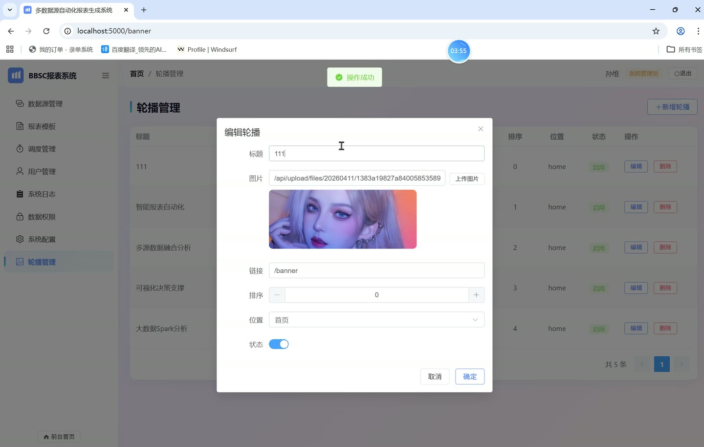
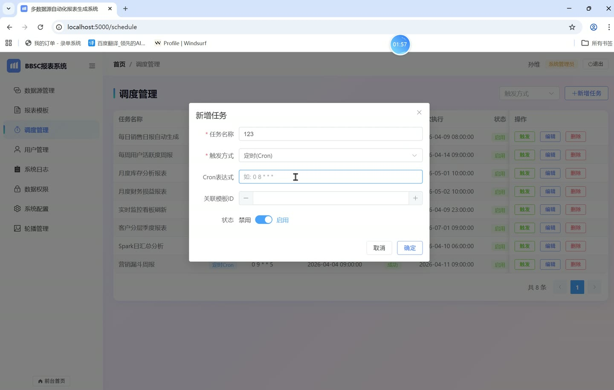
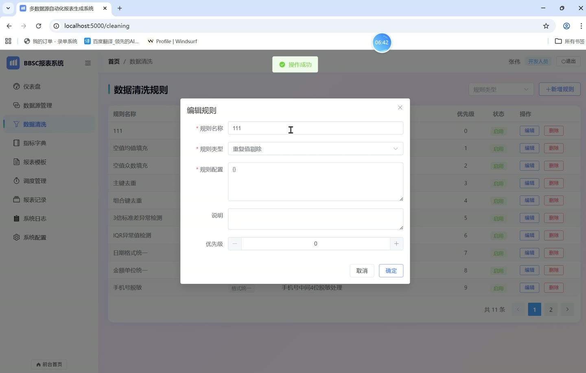
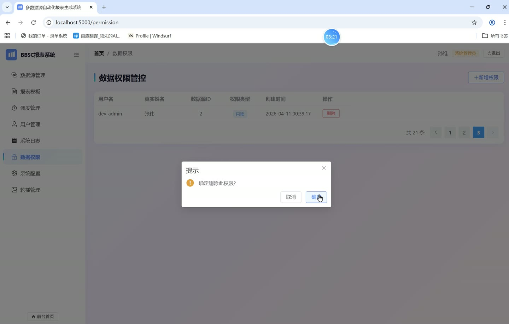
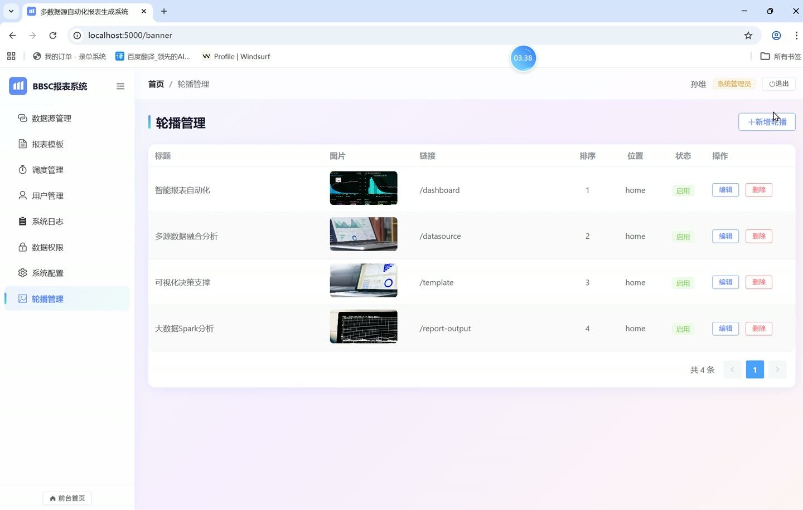
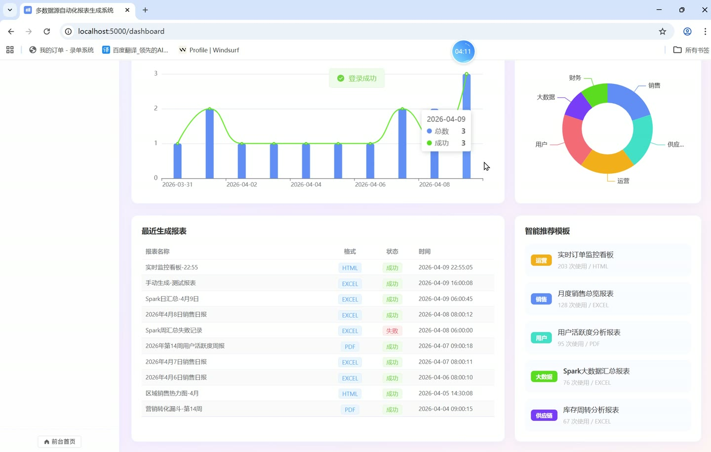

# (附文档)Python+Flask+Vue3 多数据源自动化报表生成系统

**技术栈**：Python、Flask、机器学习、Vue3、PostgreSQL

### 系统简介

本系统是一套前后端分离的多数据源自动化报表生成平台，后端基于 Python Flask 提供 REST 接口，前端使用 Vue3 构建管理后台与门户站点，数据存储采用 PostgreSQL。系统围绕数据源接入、数据清洗、指标口径、报表模板、调度任务、报表输出等环节形成完整链路，并区分前台公开访问与后台登录访问，内置开发人员、业务人员、系统管理员、决策人员四类角色。
 
### 核心功能
 
### 普通用户端

 
- 浏览前台首页，查看系统能力介绍、系统架构分层与角色说明等展示内容。 
- 查看首页轮播图，按 position 为 home 拉取启用状态的轮播并按 sortOrder 排序展示。 
- 查看公开报表模板列表，展示模板名称、模板类型、输出格式、使用次数与查询 SQL 摘要。 
- 点击首页或导航按钮跳转登录管理后台，未登录访问后台路由时自动重定向到登录页。 
- 查看页脚系统标识信息，了解当前系统版本与运行环境说明。
 
### 管理员端

 
- 仪表盘统计：展示数据源数量、报表模板数量、活跃任务数量、报表总数、生成成功数、系统用户数六项指标卡片。 
- 报表趋势图：以柱状与折线组合图展示近 30 天报表生成总数与成功数变化。 
- 模板分类分布：以环形饼图展示各分类模板数量占比。 
- 最近生成报表：列出报表名称、文件格式、状态与创建时间。 
- 智能推荐模板：按使用次数展示推荐模板的名称、分类与输出格式。 
- 数据源管理：新增、编辑、删除数据源，配置名称、类型、主机、端口、数据库名、用户名与密码。 
- 数据源连接测试：对指定数据源执行连接测试并刷新最后测试时间与状态。 
- 数据源筛选：按名称模糊搜索、按数据源类型筛选并分页展示。 
- 数据清洗规则：新增、编辑、删除规则，配置规则名称、类型、JSON 规则配置、说明与优先级。 
- 清洗规则类型：支持缺失值填充、重复值剔除、异常值检测、格式统一四类，并可按类型筛选。 
- 指标口径字典：新增、编辑、删除指标，维护指标编码、名称、分类、计算公式、单位与说明。 
- 指标检索：按关键字模糊搜索、按分类筛选并分页展示。 
- 调度任务管理：新增、编辑、删除任务，配置任务名称、触发方式、Cron 表达式、间隔秒数、关联模板 ID 与启停状态。 
- 任务触发方式：支持定时 Cron、间隔、手动三种模式，可对任务执行手动触发。 
- 任务运行信息：展示上次执行时间、上次执行状态、下次执行时间与启用状态。 
- 报表记录：按关键字、状态、文件格式筛选报表输出记录并分页展示。 
- 报表输出信息：展示报表名称、文件格式、文件大小、生成耗时、状态、文件路径与生成时间。 
- 报表统计：展示报表总数、成功数、失败数与待执行数四项汇总指标。 
- 报表删除：对指定报表输出记录执行删除操作。 
- 轮播管理：新增、编辑、删除轮播，配置标题、图片、跳转链接、排序、位置与启停状态。 
- 轮播图片上传：支持填写图片 URL 或上传本地图片文件。 
- 用户管理：对系统用户进行维护。 
- 日志管理：查看系统运行日志。 
- 权限管理：维护角色与菜单权限。 
- 系统设置：维护系统级配置项。 
- 侧边栏菜单：按登录用户拥有的菜单权限动态渲染，支持折叠展开与面包屑导航。 
- 登录与退出：支持账号密码登录、按角色快捷登录，退出后清除本地令牌并跳转登录页。
 
### 技术栈

 后端框架Python + Flask 数据库PostgreSQL 数据分析机器学习推荐、Spark 大数据处理 前端框架Vue3 前端路由Vue Router（createWebHistory） 状态管理Pinia（用户与菜单状态） UI 组件库Element Plus 图表库ECharts 样式方案SCSS 构建工具Vite
 
### 交付内容

 
- 后端完整源码 
- 前端完整源码 
- 数据库初始化脚本 
- 万字文档

## 界面展示

---

## 获取完整源码 + 万字文档

本仓库为项目介绍页。**完整前后端源码、数据库初始化脚本、万字项目文档**，请加微信 `kangkangcode`，或访问 [codekk.top](http://codekk.top) 获取。

可作课程设计 / 毕业设计参考，支持远程部署调试。